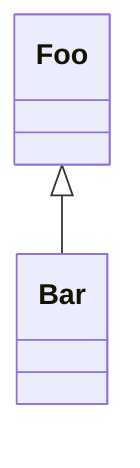

# template-bun-library

[](https://github.com/flowscripter/template-bun-library/releases)
[](https://github.com/flowscripter/template-bun-library/actions/workflows/release-bun-library.yml)
[](https://codecov.io/gh/flowscripter/template-bun-library)
[](https://flowscripter.github.io/template-bun-library/index.html)
[](https://github.com/flowscripter/template-bun-library/blob/main/LICENSE)

> Project template for a Bun library

## Template Usage

Create a new Bun project using this as a template:

`bun create @flowscripter/template-bun-library`

## Bun Module Usage

Add the module:

`bun add @flowscripter/template-bun-library`

Use the module:

```typescript
import { world } from "@flowscripter/template-deno-library";

world();
```

## Development

Test: 

`bun test`

**NOTE**: The following tasks use Deno as it excels at these and Bun does not currently provide such functionality:

Format:

`deno fmt index.ts src/ tests`

Lint:

`deno lint index.ts src/ tests/`

Generate HTML API Documentation:

`deno doc --html --name=template-bun-library index.ts`

## Documentation

### Overview

Sample mermaid diagram to test rendering in markdown:



### API

Link to auto-generated API docs:

[API Documentation](https://flowscripter.github.io/template-bun-library/index.html)

## License

MIT © Flowscripter
